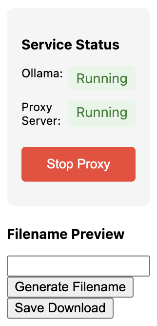

# AI Filename Generator Chrome Extension

A Chrome extension that uses AI (LLaVa) to generate descriptive filenames for images when downloading them. The extension analyzes image content and suggests meaningful filenames based on what it sees.


  “Alt Text”


## Features

- **Right-Click Menu Integration**
  - Quick save with AI-generated filename
  - Option to preview and customize filename before saving

- **Smart Filename Generation**
  - Analyzes image content using AI
  - Creates concise yet descriptive filenames
  - Supports customizable filename formats

- **Local Processing with Ollama**
  - Uses Ollama for local image analysis
  - Fast and private - no data sent to external servers
  - Requires Ollama with LLaVa model installed

- **User-Friendly Interface**
  - Image preview
  - Filename customization
  - Format templates
  - Progress indicators
  - Error handling

## Installation

1. Clone this repository or download the source code
2. Open Chrome and navigate to `chrome://extensions/`
3. Enable "Developer mode" in the top right
4. Click "Load unpacked" and select the extension directory

## Setup

### Install and Configure Ollama

1. Install [Ollama](https://ollama.ai/) for your operating system
2. Pull the LLaVa model:
   ```bash
   ollama pull llava
   ```
3. Start Ollama:
   - On macOS/Linux: Ollama runs automatically after installation
   - On Windows: Start Ollama from the Start Menu or run `ollama serve` in a terminal
4. Verify Ollama is running by opening `http://localhost:11434` in your browser

## Usage

### Quick Save
1. Right-click on any image
2. Select "Save with AI-generated filename"
3. The image will be saved automatically with an AI-generated filename

### Preview & Customize
1. Right-click on any image
2. Select "Generate filename (with preview)"
3. Click the extension icon in the toolbar
4. Preview the suggested filename
5. Edit if desired
6. Click "Save Download"

### Customize Settings
1. Click the extension icon
2. Access the Settings panel
3. Configure:
   - Filename format template
   - Preview preferences
4. Check Ollama status

## Filename Format Templates

Use these placeholders in your format:
- `{object}` - Main subject (required)
- `{location}` - Location context
- `{date}` - Current date

Example: `{object}-{location}-{date}.jpg`

## Permissions

The extension requires these permissions:
- `contextMenus`: For right-click menu integration
- `downloads`: To save images
- `storage`: To store settings
- `notifications`: For status updates
- `<all_urls>`: To access image URLs for processing

## Error Handling

The extension includes robust error handling for:
- Network issues
- API failures
- Timeout conditions
- Invalid responses
- Missing dependencies

## Development

### Project Structure
```
chrome-ai-filename-generator/
├── manifest.json          # Extension configuration
├── background.js         # Background script for context menu
├── content.js           # Content script (if needed)
├── popup/              # Extension popup UI
│   ├── popup.html
│   ├── popup.js
│   ├── popup.css
├── api/               # API integration
│   ├── analyze.js
│   ├── llava_integration.js
├── icons/           # Extension icons
└── README.md
```

### Building

No build step required. The extension uses native ES modules.

### Testing

1. Make changes to the code
2. Reload the extension in `chrome://extensions/`
3. Test the changes

## Troubleshooting

### Common Issues

1. "Cannot connect to Ollama"
   - Ensure Ollama is running
   - Try visiting `http://localhost:11434` in your browser
   - Restart Ollama if needed

2. "LLaVa model not found"
   - Run `ollama pull llava` to install the model
   - Check installed models with `ollama list`

3. "Failed to generate filename"
   - Check if Ollama is running
   - Verify the image URL is accessible
   - Try reloading the extension

4. Extension not working
   - Reload the extension in chrome://extensions
   - Restart Chrome
   - Ensure Ollama is running

## Contributing

1. Fork the repository
2. Create a feature branch
3. Make your changes
4. Submit a pull request

## License

MIT License - feel free to use and modify as needed.
